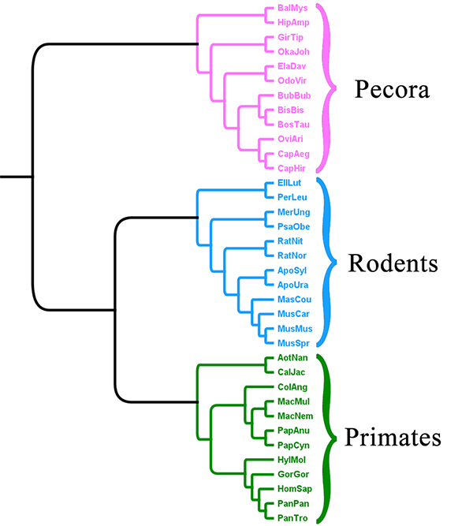
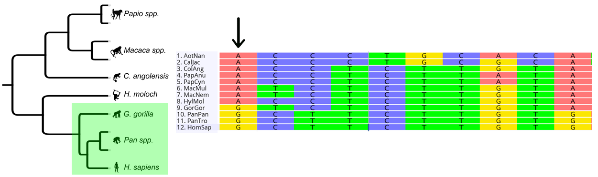
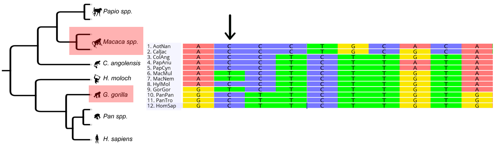

# Code Walkthrough for Literman and Schwartz (2019)  

## Please Note:  
This repo is meant as a specific walkthrough for the analyses performed in Literman and Schwartz (2019).  

### 1) Acquiring study data  
In this manuscript, we investigated how phylogenetic signal was distributed across the genomes of three focal mammal clades. The species and their shortened analysis IDs are listed below, with the reference species for each dataset indicated in **bold**. SRR numbers for all species can be found in [**Data_and_Tables/Read_Data/SRR_Table.csv**](Data_and_Tables/Read_Data/SRR_Table.csv). All reads are Illumina paired-end reads from WGS-type sequencing.  

- Catarrhine primates  (*Primates*)  
  - Colobus angolensis (ColAng)  
  - Gorilla gorilla	(GorGor)  
  - **Homo sapiens	(HomSap)**  
  - Hylobates moloch	(HylMol)  
  - Macaca mulatta	(MacMul)  
  - Macaca nemestrina	(MacNem)  
  - Pan paniscus	(PanPan)  
  - Pan troglodytes	(PanTro)  
  - Papio anubis	(PapAnu)  
  - Papio cynocephalus (PapCyn)  
  - Outgroup:  
    - Aotus nancymaae (AotNan)  
    - Callithrix jacchus (CalJac)  


- Murid rodents  (*Rodents*)  
  - Apodemus sylvaticus	(ApoSyl)  
  - Apodemus uralensis	(ApoUra)  
  - Mastomys coucha	(MasCou)  
  - Meriones unguiculatus	(MerUng)  
  - Mus caroli	(MusCar)  
  - **Mus musculus	(MusMus)**  
  - Mus spretus	(MusSpr)  
  - Psammomys obesus	(PsaObe)  
  - Rattus nitidus	(RatNit)  
  - Rattus norvegicus	(RatNor)  
  - Outgroup:  
    - Ellobius lutescens (EllLut)
    - Peromyscus leucopus (PerLeu)  


- *Pecora*  
  - Bison bison	(BisBis)  
  - **Bos taurus	(BosTau)**  
  - Bubalis bubalis	(BubBub)  
  - Capra aegagrus	(CapAeg)  
  - Capra hircus	(CapHir)  
  - Elaphurus davidianus	(ElaDav)  
  - Giraffa tippelskirchi	(GirTip)  
  - Odocoileus virginianus	(OdoVir)  
  - Okapia johnstoni	(OkaJoh)  
  - Ovis aries	(OviAri)  
  - Outgroup:  
    - Balaena mysticetus (BalMys)  
    - Hippopotamus amphibius (HipAmp)  

There was also an analysis will all 36 species combined (*Combined*).  

All reference topologies can be found in [**Data_and_Tables/Reference_Topologies**](Data_and_Tables/Reference_Topologies)



### 2) Read QC  

Read quality was assessed before and after trimming using FastQC v.0.11.5.  

HTML output from FastQC can be found in [**Data_and_Tables/Read_Data/FastQC**](Data_and_Tables/Read_Data/FastQC)  

### 3) Read trimming  

All reads were trimmed using BBDuk v.37.41 using the following command:  
```
bbduk.sh maxns=0 ref=adapters.fa qtrim=w trimq=15 minlength=35 maq=25 in=<RAW_LEFT> in2=<RAW_RIGHT> out=<TRIM_LEFT> out2=<TRIM_RIGHT> k=23 mink=11 hdist=1 hdist2=0 ktrim=r
```
Read trimming scripts can be found in [**Data_Processing_Scripts/Trim_Scripts**](Data_Processing_Scripts/Trim_Scripts)  


Read trimming output can be found in [**Data_and_Tables/Read_Data/Read_Trim_Output**](Data_and_Tables/Read_Data/Read_Trim_Output)  

### 4) Read subsetting  

The SISRS pipeline identifies orthologous loci through a 'composite genome' assembly step. The first step for this assembly is to subset the reads of each species so that ideally:  

1) Each species is represented in the assembly by the same total number of bases.  
2) Within each species, bases are sampled evenly across read sets.    
3) The pooled base count across species is ~10X genomic coverage.  
  - For this study, we used 3.5Gb as a rough genome size estimate for all groups.  

For the three focal datasets (Primtes, Rodents, and Pecora):  
- 10X = 35Gb / 12 species ~ 2,916,666,667 bases per species  

For the combined analysis: 10X = 35Gb / 36 species ~ 972,222,222 bases per species

Reads for each dataset (Primates, Rodents, Pecora, Combined) were subset using the script [**Data_Processing_Scripts/Base_SISRS_Scripts/sisrs_read_subsetter.py**](Data_Processing_Scripts/Base_SISRS_Scripts/sisrs_read_subsetter.py)  
```
python sisrs_read_subsetter.py 3500000000
```

Subset schemes used in this study can be found in [**Data_and_Tables/Subset_Schemes**](Data_and_Tables/Subset_Schemes)  
Output from subsetting can be found in [**Data_and_Tables/Subset_Schemes/Subset_Output**](Data_and_Tables/Subset_Schemes/Subset_Output)  

### 5) Composite genome assembly  

This manuscript uses Ray (https://github.com/sebhtml/ray) to assemble composite genomes. Ray commands were generated automatically by [**Data_Processing_Scripts/Base_SISRS_Scripts/sisrs_ray_composite.py**](Data_Processing_Scripts/Base_SISRS_Scripts/sisrs_ray_composite.py)  

```
#To run on 8 nodes with 20 processors per node  
python sisrs_ray_composite.py 8 20  

#Outut:
$ mpirun -n 160 Ray -k 31 {-s <READ_FILE>} -o <OUTPUT_DIR>
# Where each subset read file is indicated with a -s flag (e.g. not using paired-end information)
```

Ray assembly scripts can be found in [**Data_Processing_Scripts/Base_SISRS_Scripts/Ray_Scripts**](Data_Processing_Scripts/Base_SISRS_Scripts/Ray_Scripts)  

### 6) Running taxon-specific (independent) SISRS steps  

The next step of SISRS involves converting this single composite genome to multiple, taxon-specific ortholog sequences. This involves a few key steps:  

1) Map reads from each taxon onto composite genome  
2) Replace the composite base with the most common taxon-specific base  
3) Re-map the reads onto the new corrected genome, but for any site with less than 3 reads of coverage or more than 1 possible base, replace with 'N'  

The script [**Data_Processing_Scripts/Base_SISRS_Scripts/sisrs_setup_run.py**](Data_Processing_Scripts/Base_SISRS_Scripts/sisrs_setup_run.py) will do the following:  
- Rename Ray contigs to include 'SISRS_' prefix, build a Bowtie2 index, and move to analysis folder  
- Generate scripts to perform Steps 1-3 above  

```
#For 20 processors, minimum read coverage of 3 reads, and 100% intraspecies homozygosity at each called site:
python sisrs_setup_run.py 20 3 1
```
Running this script will prepare the composite genome, then generate a separate SISRS script for each taxon (TAXA), the skeleton of which is below:  
```
#!/bin/sh
bowtie2 -p PROCESSORS -N 1 --local -x BOWTIE2-INDEX -U READS | samtools view -Su -@ PROCESSORS -F 4 - | samtools sort -@ PROCESSORS - -o SISRS_DIR/TAXA/TAXA_Temp.bam

samtools view -@ PROCESSORS -H SISRS_DIR/TAXA/TAXA_Temp.bam > SISRS_DIR/TAXA/TAXA_Header.sam

samtools view -@ PROCESSORS SISRS_DIR/TAXA/TAXA_Temp.bam | grep -v "XS:" | cat SISRS_DIR/TAXA/TAXA_Header.sam - | samtools view -@ PROCESSORS -b - > SISRS_DIR/TAXA/TAXA.bam

rm SISRS_DIR/TAXA/TAXA_Temp.bam
rm SISRS_DIR/TAXA/TAXA_Header.sam

samtools mpileup -f COMPOSITE_GENOME SISRS_DIR/TAXA/TAXA.bam > SISRS_DIR/TAXA/TAXA.pileups

python SCRIPT_DIR/specific_genome.py SISRS_DIR/TAXA COMPOSITE_GENOME

samtools faidx SISRS_DIR/TAXA/contigs.fa
bowtie2-build SISRS_DIR/TAXA/contigs.fa SISRS_DIR/TAXA/contigs -p PROCESSORS

bowtie2 -p PROCESSORS -N 1 --local -x SISRS_DIR/TAXA/contigs -U READS | samtools view -Su -@ PROCESSORS -F 4 - | samtools sort -@ PROCESSORS - -o SISRS_DIR/TAXA/TAXA_Temp.bam

samtools view -@ PROCESSORS -H SISRS_DIR/TAXA/TAXA_Temp.bam > SISRS_DIR/TAXA/TAXA_Header.sam
samtools view -@ PROCESSORS SISRS_DIR/TAXA/TAXA_Temp.bam | grep -v "XS:" | cat SISRS_DIR/TAXA/TAXA_Header.sam - | samtools view -@ PROCESSORS -b - > SISRS_DIR/TAXA/TAXA.bam

rm SISRS_DIR/TAXA/TAXA_Temp.bam
rm SISRS_DIR/TAXA/TAXA_Header.sam

samtools index SISRS_DIR/TAXA/TAXA.bam

samtools mpileup -f COMPOSITE_GENOME SISRS_DIR/TAXA/TAXA.bam > SISRS_DIR/TAXA/TAXA.pileups

python SCRIPT_DIR/get_pruned_dict.py SISRS_DIR/TAXA COMPOSITE_DIR MINREAD THRESHOLD
```

These scripts and their output can be found in [**Data_Processing_Scripts/Base_SISRS_Scripts/Taxon_SISRS_Scripts**](Data_Processing_Scripts/Base_SISRS_Scripts/Taxon_SISRS_Scripts)  

### 7) Output SISRS alignments

The final step of the SISRS pipeline takes the output from each species and creates a series of alignments:  
- All variable sites
- All variable sites without singletons (parsimony-informative sites)
- All biallelic parsimony-informative sites

Running the script [**Data_Processing_Scripts/Base_SISRS_Scripts/sisrs_output.py**](Data_Processing_Scripts/Base_SISRS_Scripts/sisrs_output.py) will generate these alignments both with and without gap positions, and with a number of species allowed to be missing (0 in this study). This script will also compile summary outputs.
```
#To output gapped and ungapped alignments with 0 taxa allowed missing
python sisrs_output.py 0
```
The output from these scripts can be found in [**Data_and_Tables/SISRS_Alignment_Output**](Data_and_Tables/SISRS_Alignment_Output)  

**Note:** This represents the terminal output of a traditional SISRS run.

### 8) Filtering SISRS orthologs via reference genome mapping  

Because SISRS-derived orthologs are generated via *de novo* genome assembly, the assembled contigs lack any annotation or locus information. By having one species per focal dataset with a well-assembled and well-annotated reference genome, we were able to further filter the SISRS orthologs based on their ability to uniquely map to the reference genome.

We downloaded canonical chromosomes (e.g. no unlinked or alternative scaffolds) + MT scaffolds from the Ensembl Build 92 versions of the *Homo sapiens*, *Mus musculus*, and *Bos taurus* genomes and their associated annotation files.  

Bowtie2 and Samtools indexes were made for each genome...  
```
bowtie2-build Homo_sapiens.GRCh38.dna.chromosome.CANONICAL.fa HomSap_Ens92
samtools faidx Homo_sapiens.GRCh38.dna.chromosome.CANONICAL.fa

bowtie2-build Mus_musculus.GRCm38.dna.chromosome.CANONICAL.fa MusMus_Ens92
samtools faidx Mus_musculus.GRCm38.dna.chromosome.CANONICAL.fa

bowtie2-build Bos_taurus.UMD3.1.dna.chromosome.CANONICAL.fa BosTau_Ens92
samtools faidx Bos_taurus.UMD3.1.dna.chromosome.CANONICAL.fa
```

For each dataset (*Primates*, *Rodents*, *Pecora*, *Combined*), the reference species (*HomSap*, *MusMus*, *BosTau*, *HomSap*) orthologs were mapped against the reference genome using [**Data_Processing_Scripts/Post_SISRS_Scripts/post_sisrs_reference.py**](Data_Processing_Scripts/Post_SISRS_Scripts/post_sisrs_reference.py). This script:  

- Removes contigs that cannot be mapped to the reference (and therefore cannot be annotated)  
- Removes contigs that multiply map (obscuring their evolutionary origin)  
- Separates data into gapped and gapless subsets
- Removes sites that are contained in multiple contigs (contigs that map to overlapping positions in the reference)
- Provides a coordinate system for downstream annotation  

```
# 20 refers to 20 processors

# Primates
python post_sisrs_reference.py 20 HomSap

# Rodents
python post_sisrs_reference.py 20 MusMus

# Pecora
python post_sisrs_reference.py 20 BosTau

# Combined
python post_sisrs_reference.py 20 HomSap
```

The output from these scripts can be found in [**Data_Processing_Scripts/Post_SISRS_Scripts/Post_SISRS_Output_Logs**](Data_Processing_Scripts/Post_SISRS_Scripts/Post_SISRS_Output_Logs)  

### 9) Identifying phylogenetic signal from alignments of biallelic SISRS sites  

Each biallelic SISRS site splits the data into two sets of taxa. If the taxonomic splits agree with a split in the reference topology, that site is designated as '**concordant**', or providing historical phylogenetic signal.  

  

If the taxonomic split does not agree with a split in the reference topology, that site is designated as '**discordant**', or providing non-historical phylogenetic signal.  

  

Site splits were tabulated using [**Data_Processing_Scripts/Post_SISRS_Scripts/post_sisrs_site_splits.py**](Data_Processing_Scripts/Post_SISRS_Scripts/post_sisrs_site_splits.py)  

Site split output can be found in [**Data_and_Tables/Site_Splits**](Data_and_Tables/Site_Splits)  


### 10) Site Annotation  

Once sites were mapped to the reference genome, BEDTools was used to transfer annotations from the reference genome to the SISRS orthologs. In this way, each site can be annotated as one of the following locus types:  
- Coding sequence (CDS). including all annotated transcript variants  
- Five-prime UTR  
- Three-prime UTR  
- Intronic (gene region minus CDS/UTR)
- Pseudogenes  
- Long-noncoding RNA (lncRNA; none annotated in Pecora)  
- Noncoding Genes (genes without annotated CDS; none annotated in Pecora)  
- Small RNAs (smRNA; miRNAs + ncRNAs + rRNAs + scRNAs + smRNAs + snoRNAs + snRNAs + tRNAs + vaultRNAs)  
- Intergenic/Unannotated  

In some cases an individual SISRS site may have multiple annotations types, such as pseudogenes within introns, or alternative five prime UTR regions overlapping CDS.

Sites were annotated using [**Data_Processing_Scripts/Post_SISRS_Scripts/post_sisrs_site_annotation.py**](Data_Processing_Scripts/Post_SISRS_Scripts/post_sisrs_site_annotation.py)  


```
# 20 refers to 20 processors

# Primates
python post_sisrs_site_annotation.py 20 HomSap

# Rodents
python post_sisrs_site_annotation.py 20 MusMus

# Pecora
python post_sisrs_site_annotation.py 20 BosTau

# Combined
python post_sisrs_site_annotation 20 HomSap
```

Site annotation output can be found in [**Data_and_Tables/Annotation_Counts**](Data_and_Tables/Annotation_Counts)  

### 11) Node Dating  

In order to look at changes in phylogenetic utility over evolutionary time, nodes in the reference topologies were dated using a subset of the SISRS ortholog data. Briefly, all SISRS orthologs were sorted based on the total number of SISRS sites contained within. The top 50,000 orthologs were aligned and concatenated. Using those alignments, we estimated branch lengths on the fixed reference topology. These alignments are generated using [**Data_Processing_Scripts/Post_SISRS_Scripts/post_sisrs_chronos.py**](Data_Processing_Scripts/Post_SISRS_Scripts/post_sisrs_chronos.py)  

```
#Primates
python post_sisrs_chronos.py 20 HomSap 50000

#Rodents
python post_sisrs_chronos.py 20 MusMus 50000

#Pecora
python post_sisrs_chronos.py 20 BosTau 50000

#Combined
python post_sisrs_chronos.py 20 HomSap 50000
```

The output from these scripts can be found in [**Data_and_Tables/Node_Date_Information/01_RAxML_Trees**](Data_and_Tables/Node_Date_Information/01_RAxML_Trees)

**INTRO R**
Using these branch length estimates, divergence times for each focal node in the reference topology was estimated 1000 times using the chronos function in R, from the ape package. The median value for each node age was computed and used for downstream analyses. For each focal group, the root node age was calibrated using minimum and maximum divergence times estimates from the TimeTree.org database (accessed 05.30.2019). For the Combined analysis, we calibrated the root node of the entire tree, as well as the root nodes for each focal group.  


### 12) Assessing assembly biases  
